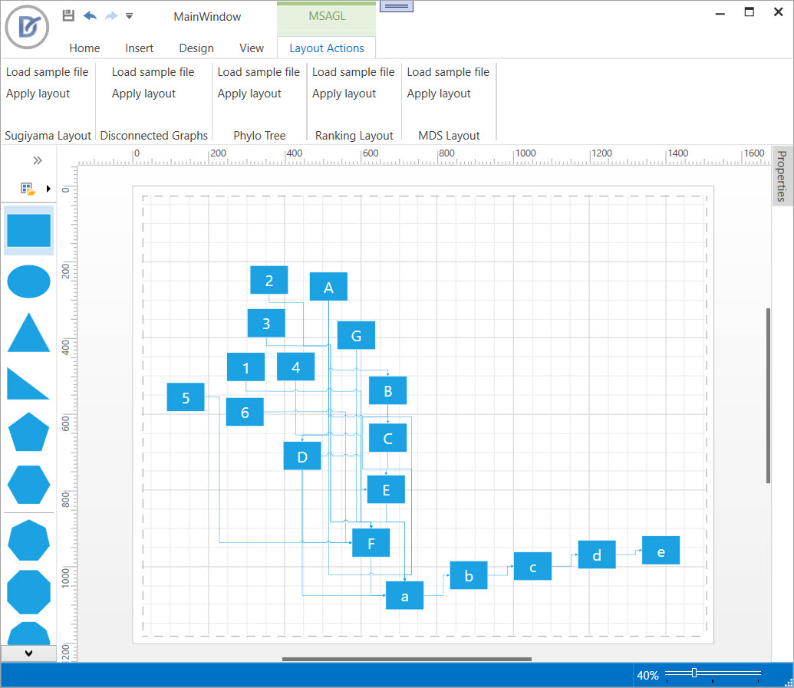

<!-- default badges list -->

[](https://supportcenter.devexpress.com/ticket/details/T394199)
[](https://docs.devexpress.com/GeneralInformation/403183)
[](#does-this-example-address-your-development-requirementsobjectives)
<!-- default badges end -->
<!-- default badges list -->

[](https://supportcenter.devexpress.com/ticket/details/T394199)
[](https://docs.devexpress.com/GeneralInformation/403183)
[](#does-this-example-address-your-development-requirementsobjectives)

# WPF Diagram Control - Microsoft Automatic Graph Layout (MSAGL) Algorithms

This example integrates **Microsoft Automatic Graph Layout (MSAGL)** algorithms with the WPF [`DiagramControl`](https://docs.devexpress.com/WPF/DevExpress.Xpf.Diagram.DiagramControl). The workflow extracts a graph from the diagram, processes it with an MSAGL algorithm, and applies calculated node positions to diagram items.



## Implementation Details

### Extract the Graph

Use the `GraphOperations.GetDiagramGraph` method to extract the current diagram. The method returns a `Graph` object that contains the collections of nodes and edges represented by diagram items:

```csharp
GraphOperations.GetDiagramGraph(diagramControl);
```

### Calculate Position Information

For each shape, calculate diagram shape coordinates and store them in `PositionInfo` objects:

```csharp
layout.RelayoutGraphNodesPosition(GraphOperations.GetDiagramGraph(diagramControl));

public virtual IEnumerable<PositionInfo<IDiagramItem>> RelayoutGraphNodesPosition(Graph<IDiagramItem> graph) {
    GeometryGraph = MsaglGeometryGraphHelpers.CreateGeometryGraph(graph);
    LayoutCalculator.CalculateLayout(GeometryGraph);
    return MsaglGeometryGraphHelpers.GetGetNodesPositionInfo(GeometryGraph);
}
```

### Apply Layout

Update the diagram with calculated node positions:

```csharp
diagramControl.RelayoutDiagramItems(
    layout.RelayoutGraphNodesPosition(GraphOperations.GetDiagramGraph(diagramControl))
);
```

### Update Shape Connectors

After shapes are repositioned, reroute shape connectors and register a routing strategy:

```csharp
diagramControl.Items.OfType<IDiagramConnector>().ForEach(connector => {
    connector.Type = layout.GetDiagramConnectorType();
    connector.UpdateRoute();
});

diagramControl.Controller.RegisterRoutingStrategy(
    layout.GetDiagramConnectorType(), 
    layout.GetDiagramRoutingStrategy()
);
```

### Display Entire Diagram

Fit the view so that all items are visible in the viewport:

```csharp
diagramControl.FitToDrawing();
```

### Ribbon commands

Create ribbon items and handle their `ItemClick` events to apply different MSAGL algorithms:

```csharp
void ApplySugiyama(object s, ItemClickEventArgs e) {
    ApplyLayout(new GraphLayout(new SugiyamaLayoutCalculator()));
}
void ApplyRanking(object s, ItemClickEventArgs e) {
    ApplyLayout(new GraphLayout(new RankingLayoutCalculator()));
}
void ApplyPhyloTree(object s, ItemClickEventArgs e) {
    ApplyLayout(new PhyloTreeLayout(new PhyloTreeLayoutCalculator()));
}
void ApplyMDS(object s, ItemClickEventArgs e) {
    ApplyLayout(new GraphLayout(new MDSLayoutCalculator()));
}
void ApplyDisconnectedGraphs(object s, ItemClickEventArgs e) {
    ApplyLayout(new GraphLayout(new DisconnectedGraphsLayoutCalculator()));
}
```

## Files to Review

* [LayoutExampleWindow.xaml](./CS/DXDiagram.CustomLayoutAlgorithms/LayoutExampleWindow.xaml) (VB: [LayoutExampleWindow.xaml](./VB/DXDiagram.CustomLayoutAlgorithms/LayoutExampleWindow.xaml))
* [LayoutExampleWindow.xaml.cs](./CS/DXDiagram.CustomLayoutAlgorithms/LayoutExampleWindow.xaml.cs) (VB: [LayoutExampleWindow.xaml.vb](./VB/DXDiagram.CustomLayoutAlgorithms/LayoutExampleWindow.xaml.vb))
* [MainWindow.xaml](./CS/DXDiagram.CustomLayoutAlgorithms/MainWindow.xaml) (VB: [MainWindow.xaml](./VB/DXDiagram.CustomLayoutAlgorithms/MainWindow.xaml))
* [MainWindow.xaml.cs](./CS/DXDiagram.CustomLayoutAlgorithms/MainWindow.xaml.cs) (VB: [MainWindow.xaml.vb](./VB/DXDiagram.CustomLayoutAlgorithms/MainWindow.xaml.vb))
* [Converter.cs](./CS/MsaglHelpers/Converter.cs) (VB: [Converter.vb](./VB/MsaglHelpers/Converter.vb))
* [GraphLayout.cs](./CS/MsaglHelpers/Layout/GraphLayout.cs) (VB: [GraphLayout.vb](./VB/MsaglHelpers/Layout/GraphLayout.vb))
* [PhyloTreeLayout.cs](./CS/MsaglHelpers/Layout/PhyloTreeLayout.cs) (VB: [PhyloTreeLayout.vb](./VB/MsaglHelpers/Layout/PhyloTreeLayout.vb))
* [DisconnectedGraphsLayoutCalculator.cs](./CS/MsaglHelpers/LayoutCalculators/DisconnectedGraphsLayoutCalculator.cs) (VB: [DisconnectedGraphsLayoutCalculator.vb](./VB/MsaglHelpers/LayoutCalculators/DisconnectedGraphsLayoutCalculator.vb))
* [ILayoutCalculator.cs](./CS/MsaglHelpers/LayoutCalculators/ILayoutCalculator.cs) (VB: [ILayoutCalculator.vb](./VB/MsaglHelpers/LayoutCalculators/ILayoutCalculator.vb))
* [MDSLayoutCalculator.cs](./CS/MsaglHelpers/LayoutCalculators/MDSLayoutCalculator.cs) (VB: [MDSLayoutCalculator.vb](./VB/MsaglHelpers/LayoutCalculators/MDSLayoutCalculator.vb))
* [PhyloTreeLayoutCalculator.cs](./CS/MsaglHelpers/LayoutCalculators/PhyloTreeLayoutCalculator.cs) (VB: [PhyloTreeLayoutCalculator.vb](./VB/MsaglHelpers/LayoutCalculators/PhyloTreeLayoutCalculator.vb))
* [RankingLayoutCalculator.cs](./CS/MsaglHelpers/LayoutCalculators/RankingLayoutCalculator.cs) (VB: [RankingLayoutCalculator.vb](./VB/MsaglHelpers/LayoutCalculators/RankingLayoutCalculator.vb))
* [SugiyamaLayoutCalculator.cs](./CS/MsaglHelpers/LayoutCalculators/SugiyamaLayoutCalculator.cs) (VB: [SugiyamaLayoutCalculator.vb](./VB/MsaglHelpers/LayoutCalculators/SugiyamaLayoutCalculator.vb))
* [MsaglGeometryGraphHelpers.cs](./CS/MsaglHelpers/MsaglGeometryGraphHelpers.cs) (VB: [MsaglGeometryGraphHelpers.vb](./VB/MsaglHelpers/MsaglGeometryGraphHelpers.vb))
* [RoutingHelper.cs](./CS/MsaglHelpers/RoutingHelper.cs) (VB: [RoutingHelper.vb](./VB/MsaglHelpers/RoutingHelper.vb))

## Documentation

* [DiagramControl](https://docs.devexpress.com/WPF/DevExpress.Xpf.Diagram.DiagramControl)
* [Diagram Items](https://docs.devexpress.com/WPF/116675/controls-and-libraries/diagram-control/diagram-items)
* [DiagramDesignerControl](https://docs.devexpress.com/WPF/DevExpress.Xpf.Diagram.DiagramDesignerControl)
* [RibbonControl](https://docs.devexpress.com/WPF/DevExpress.Xpf.Ribbon.RibbonControl)
* [RibbonPageCategory](https://docs.devexpress.com/WPF/DevExpress.Xpf.Ribbon.RibbonPageCategory)
* [RibbonPage](https://docs.devexpress.com/WPF/DevExpress.Xpf.Ribbon.RibbonPage)

## More Examples

* [WPF DiagramControl - Create Custom Shapes with Connection Points](https://github.com/DevExpress-Examples/wpf-diagramdesigner-create-custom-shapes-with-connection-points)
* [WPF DiagramControl - Create Custom Context Menus](https://github.com/DevExpress-Examples/wpf-diagram-custom-context-menu)
* [WPF Diagram Control - Track and Restrict Drag Actions](https://github.com/DevExpress-Examples/wpf-diagram-track-and-restrict-drag-actions)

<!-- feedback -->
## Does This Example Address Your Development Requirements/Objectives?

[](https://www.devexpress.com/support/examples/survey.xml?utm_source=github&utm_campaign=wpf-diagram-ms-automatic-graph-layout-algorithms&~~~was_helpful=yes) [](https://www.devexpress.com/support/examples/survey.xml?utm_source=github&utm_campaign=wpf-diagram-ms-automatic-graph-layout-algorithms&~~~was_helpful=no)

(you will be redirected to DevExpress.com to submit your response)
<!-- feedback end -->
